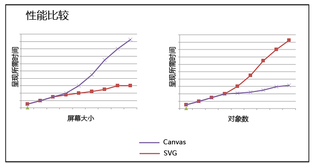
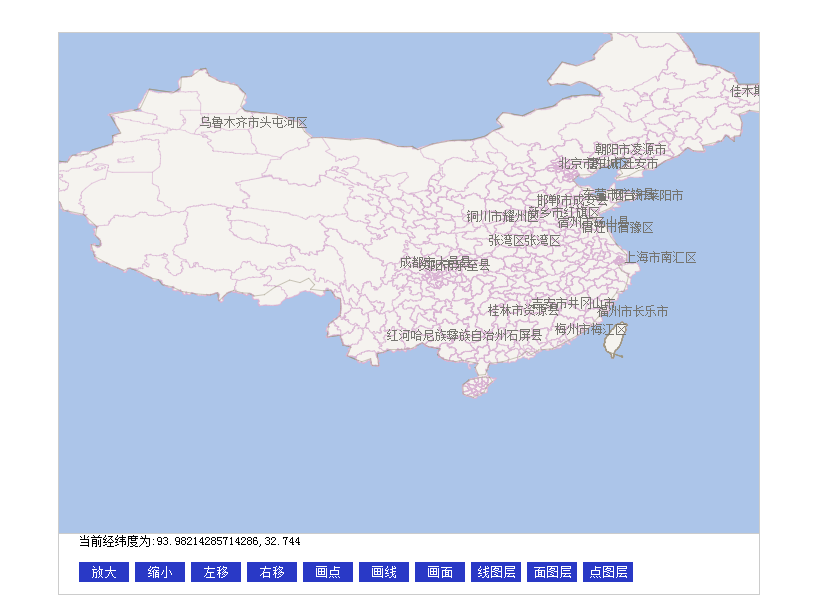
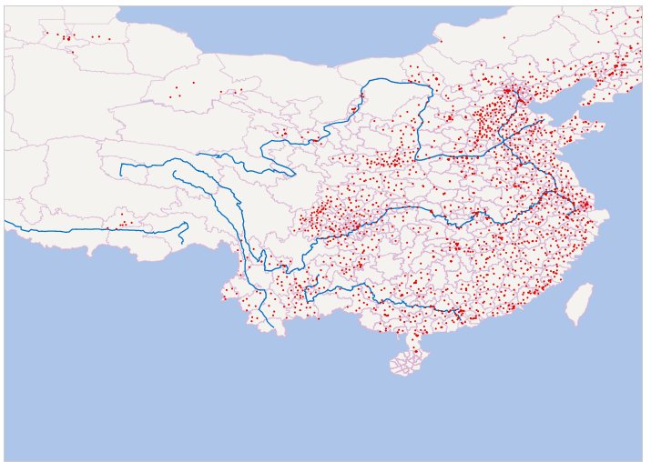

矢量地图渲染
====
#####一、引
引：现在主流的地图的渲染方式是以切片的形式展现。但是随着HTML5的推广和浏览器性能的提高的，canvas的绘图效率十分惊人。当然canvas的产生，对游戏、矢量图的绘制产生的深远的影响。
矢量图：矢量图形不是新概念。它们是全部基于矢量来表示图像的几何基元（形状、点、线条和多边形）。在 1960 年代后期，向 Logo 编程语言添加了矢量图形语言（海龟绘图）来支持用于执行绘图功能的海龟机器人。虽然图形世界在复杂性方面已经发生了重大的演变，但是存在的基本概念是相同的。
借助 HTML5，开发人员或设计人员现在可以使用基于标准的技术来创建以前的体验。这样可消除对插件的安装（50% 的网站放弃访问均与插件的安装相关），从而可以极大地改善用户体验。目前，图形由浏览器原生提供，而对于 Internet Explorer 9，则利用 Microsoft Windows 和硬件加速图形的功能。
####一、SVG VS Canvas   
      
一般情况下，随着屏幕大小的增大，画布将开始降级，因为需要绘制更多的像素。随着屏幕上的对象数目增多，SVG 将开始降级，因为我们正不断将这些对象添加到 DOM 中。这些度量不一定准确，以下方面的不同一定会引起变化：实现和平台、是否使用完全硬件加速的图形，以及 JavaScript 引擎的速度。     
具体见：http://msdn.microsoft.com/zh-cn/library/gg193983    
因此根据地理信息数据，利用HTML5新特性canvas，矢量渲染地图。  

####二、矢量绘制结果
######全国省市行政区绘制

######加上2019个县级GPS坐标和一级河流绘制

